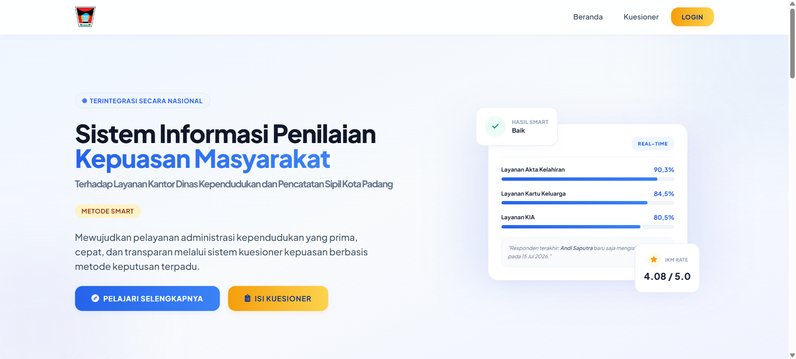

# Sistem Informasi Penilaian Kepuasan Masyarakat (SI-IKM SMART)
### Dinas Kependudukan dan Pencatatan Sipil Kota Padang

---

[](file:///c:/laragon/www/web_discakpil/assets/logo-git.png)

## 📌 Deskripsi Proyek
SI-IKM SMART adalah platform berbasis web yang dikembangkan khusus untuk **Dinas Kependudukan dan Pencatatan Sipil (DISDUKCAPIL) Kota Padang**. Aplikasi ini berfungsi untuk mengukur, menganalisis, dan melaporkan Indeks Kepuasan Masyarakat (IKM) terhadap layanan kependudukan secara digital dan otomatis menggunakan algoritma **SMART (Simple Multi-Attribute Rating Technique)**.

Aplikasi ini memfasilitasi survei kepuasan bagi masyarakat umum, pengolahan data kriteria dan sub-kriteria dinamis oleh administrator, serta pembuatan laporan berstandar formal (PDF/Cetak) untuk kebutuhan pimpinan.

---

## 🛠️ Fitur Utama
*   **Pengisian Kuesioner Publik**: Halaman survei interaktif yang ramah pengguna (user-friendly) untuk mengumpulkan umpan balik masyarakat mengenai layanan KTP-el, KK, KIA, Akta Lahir, dll.
*   **Sistem Evaluasi SMART**: Algoritma perhitungan yang menormalisasi bobot kriteria, menghitung nilai utilitas sub-kriteria, dan merangkum skor akhir IKM untuk setiap alternatif layanan.
*   **Dashboard Statistik Dinamis**: Panel administrasi yang menyajikan grafik performa layanan, jumlah responden harian, distribusi bobot kriteria, serta aktivitas terbaru secara *real-time*.
*   **Pengaturan TTD & Laporan Kustom**: Sistem fleksibel untuk memperbarui Nama dan NIP Penandatangan Laporan (Kepala Dinas & Petugas) langsung melalui tab cetak laporan.
*   **Cetak PDF Formal**: Menghasilkan dokumen cetak landscape presisi tinggi dengan kop surat dinas yang rapi, tabel hitam formal, dan logo kementerian.
*   **Otentikasi & Keamanan**: Proteksi berlapis untuk role Admin, Kepala Dinas, dan Staff menggunakan enkripsi kata sandi serta modal interaktif SweetAlert2.

---

## 📂 Struktur Direktori Project
```
web_discakpil/
├── assets/                 # Aset Frontend (CSS, JS, Images)
│   ├── css/                # Style kompilasi Tailwind CSS (app.css)
│   ├── images/             # Berkas logo, qr-code, & infografis
│   └── js/                 # Skrip pendukung frontend
├── config/                 # Konfigurasi Inti Aplikasi
│   └── Database.php        # Pengaturan PDO database connection
├── controllers/            # Controller (MVC Pattern)
│   ├── AdminController.php
│   ├── AlternatifController.php
│   ├── AuthController.php
│   ├── CetakController.php
│   ├── DashboardController.php
│   ├── HasilController.php
│   ├── KriteriaController.php
│   ├── LandingController.php
│   ├── LaporanController.php
│   ├── PenilaianController.php
│   ├── RespondenController.php
│   └── SubKriteriaController.php
├── database/               # Berkas skema SQL & migrasi data
├── docs/                   # Dokumentasi teknis tambahan
├── models/                 # Model Data untuk manipulasi DB (MVC)
│   ├── AlternatifModel.php
│   ├── DashboardModel.php
│   ├── HasilModel.php
│   ├── KriteriaModel.php
│   ├── LaporanModel.php
│   ├── PdfHelper.php       # Utilitas pembuat dokumen PDF resmi
│   ├── PenilaianModel.php
│   ├── RespondenModel.php
│   ├── SubKriteriaModel.php
│   └── UserModel.php
├── template/               # Tata Letak Layout Bersama
│   ├── layout_admin_chrome.php # Wrapper navigasi admin
│   ├── layout_admin_foot.php
│   ├── layout_admin_head.php
│   ├── layout_public_foot.php  # Footer publik (mengandung notifikasi)
│   └── layout_public_head.php  # Header publik
├── vendor/                 # Pustaka Pihak Ketiga (Composer)
├── views/                  # UI Templates (MVC)
│   ├── alternatif/
│   ├── auth/               # Desain form login
│   ├── dashboard/
│   ├── hasil/
│   ├── kriteria/
│   ├── kuesioner/          # Pengisian survei publik
│   ├── landing/            # Beranda web utama
│   ├── laporan/
│   ├── penilaian/
│   ├── responden/
│   └── sub_kriteria/
├── index.php               # Front Controller / Pintu Masuk Aplikasi
├── package.json            # Daftar dependensi npm
├── tailwind.config.js      # Konfigurasi grid & tema Tailwind CSS
└── README.md               # Berkas ini
```

---

## 💻 Cara Instalasi & Menjalankan Aplikasi

### Persyaratan Sistem:
*   PHP >= 8.0 (Direkomendasikan PHP 8.1 / 8.2)
*   MySQL / MariaDB
*   Composer (untuk manajemen dependensi backend)
*   Node.js & npm (untuk kompilasi Tailwind CSS)
*   Laragon atau XAMPP sebagai server lokal

### Langkah Penyiapan:
1.  **Clone atau Salin Repository**:
    Letakkan folder proyek di direktori root server lokal Anda (misal `C:\laragon\www\web_discakpil` atau `C:\xampp\htdocs\web_discakpil`).
    
2.  **Impor Database**:
    *   Buat database baru bernama `db_disdukcapil_smart` di PHPMyAdmin.
    *   Impor berkas SQL terupdate dari folder `database/` ke database tersebut.

3.  **Konfigurasi Koneksi Database**:
    Buka file [Database.php](file:///c:/laragon/www/web_discakpil/config/Database.php) dan sesuaikan username/password MySQL server lokal Anda:
    ```php
    private $host = "localhost";
    private $db_name = "db_disdukcapil_smart";
    private $username = "root";
    private $password = ""; // Sesuaikan password local db Anda
    ```

4.  **Instal Dependensi Backend (Composer)**:
    Buka terminal di root folder project lalu jalankan:
    ```bash
    composer install
    ```

5.  **Instal & Jalankan Kompilasi Frontend (Tailwind)**:
    Pasang modul node untuk Tailwind CSS dan build asset:
    ```bash
    npm install
    npm run build:css
    ```

6.  **Akses Aplikasi**:
    Buka peramban (browser) dan ketik:
    *   Halaman Utama: `http://localhost/web_discakpil/`
    *   Halaman Login: `http://localhost/web_discakpil/index.php?controller=auth&action=index`
    *   *Default Login Admin*: Username: `admin` | Password: `adminpassword`

---

## 👥 Layanan Dukungan Teknis (Support & Donation)

Jika Anda menemui kendala atau ingin memberikan dukungan donasi kepada pengembang, silakan hubungi narahubung support atau pindai kode QR donasi di bawah ini:

| Hubungi Support | Pindai Kode QR Donasi |
| :---: | :---: |
|  |  |
| **Tim Teknis Synectra**<br>✉️ [synectra24@gmail.com](mailto:synectra24@gmail.com)<br>📞 [+62 888-0737-6359](https://wa.me/6288807376359) | **Scan QR Donasi Support**<br>Salurkan dukungan Anda secara langsung |

---

## 📜 Lisensi & Hak Cipta
Aplikasi ini dikembangkan dan didistribusikan secara resmi di bawah lisensi berikut:

### 📄 MIT License
Hak Cipta &copy; 2026 **Synectra Jasa Digital**.

Dengan ini diberikan izin, secara gratis, kepada siapa pun yang memperoleh salinan perangkat lunak ini dan file dokumentasi terkait (Perangkat Lunak), untuk mempergunakan Perangkat Lunak tanpa batasan, termasuk namun tidak terbatas pada hak untuk menggunakan, menyalin, memodifikasi, menggabungkan, menerbitkan, mendistribusikan, mensublisensikan, dan/atau menjual salinan Perangkat Lunak, sesuai dengan ketentuan lisensi MIT.
