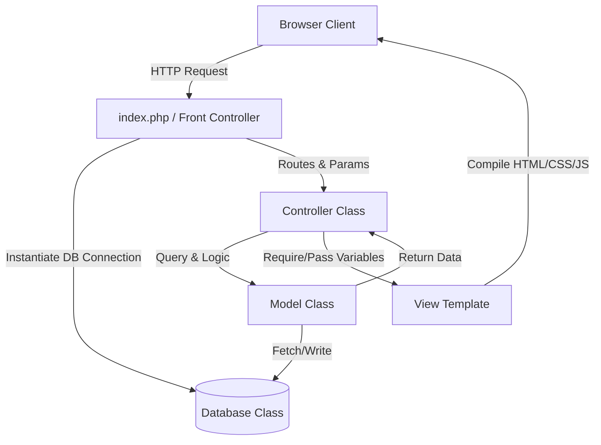

# Panduan Transfer Knowledge SI-IKM SMART
### Dokumentasi Pengembangan dan Pemeliharaan Sistem bagi Tim IT & Developer

---

## 🏗️ 1. Arsitektur MVC & Mekanisme Routing

Sistem dibangun menggunakan arsitektur **MVC (Model-View-Controller)** murni berbasis PHP Native tanpa framework besar, untuk mengoptimalkan performa server instansi dan meminimalisir ketergantungan library luar.

### Mekanisme Routing (Front Controller)
Seluruh request dari pengguna diarahkan ke berkas utama [index.php](file:///c:/laragon/www/web_discakpil/index.php). Aliran routing berjalan sebagai berikut:
1.  URL dibaca untuk mengambil parameter `controller` dan `action` (contoh: `index.php?controller=kriteria&action=edit&id=5`).
2.  `index.php` memvalidasi keberadaan berkas controller terkait di folder `controllers/`.
3.  Koneksi database dari kelas `Database` dibuat secara otomatis dan dioperasikan ke konstruktor controller yang bersangkutan.
4.  Controller melakukan operasi logika data melalui berkas Model di folder `models/` lalu mengirimkan hasilnya ke views di folder `views/`.



---

## 🗄️ 2. Struktur Database & Model Relasional

Sistem menggunakan database relasional MySQL. Berikut adalah ringkasan kegunaan tabel-tabel utama:

1.  **`users`**: Menyimpan kredensial otentikasi login admin, staf, dan kepala dinas. Diperbarui untuk mendukung kolom data `nip` dinamis untuk tanda tangan laporan.
2.  **`alternatif`**: Menyimpan jenis layanan publik yang dievaluasi (misal: A1 = KTP-el, A2 = KIA).
3.  **`kriteria`**: Menyimpan kriteria dasar penilaian kepuasan (C1-C9) beserta nilai bobot aslinya.
4.  **`sub_kriteria`**: Menyimpan opsi jawaban kuesioner dengan nilai utility terkait.
5.  **`responden`**: Menyimpan profil demografi responden (nama, usia, pekerjaan, tanggal pengisian).
6.  **`penilaian`**: Tabel transaksi yang mencatat pilihan jawaban responden terhadap setiap layanan dan kriteria.
7.  **`hasil_akhir`**: Menyimpan hasil pengolahan data SMART (nilai akhir dan keterangan ranking) per layanan.

---

## 🖨️ 3. Mekanisme Cetak Laporan PDF & Pengaturan TTD

Salah satu modul penting dalam sistem ini adalah pembuatan laporan formal dinas berformat PDF menggunakan TCPDF.

### Utilitas PDF ([models/PdfHelper.php](file:///c:/laragon/www/web_discakpil/models/PdfHelper.php))
Modul ini diatur lewat kelas helper dengan fungsi statis penting:
*   `headerKopSurat()`: Mengatur tata letak kop surat resmi dinas agar rapi secara visual, termasuk penataan logo dan teks instansi di bagian atas halaman landscape.
*   `getKepalaDinas()` & `getPetugas()`: Mengambil profil penandatangan dokumen (Nama dan NIP) secara dinamis dari database (tabel `users` berdasarkan role/ID).
*   `signatureBlock()`: Merender blok tanda tangan Kepala Dinas di sebelah kiri dan Petugas di sebelah kanan. Jarak letak horizontal tanda tangan kanan telah digeser secara presisi sebesar 20% lebih ke kanan menggunakan pengaturan kolom TCPDF untuk mencapai tata letak formal yang seimbang.

### Konfigurasi TTD Dinamis ([views/cetak/index.php](file:///c:/laragon/www/web_discakpil/views/cetak/index.php))
Pengaturan Nama dan NIP penandatangan laporan diintegrasikan ke halaman Cetak Laporan melalui sistem tab:
*   **Tab Laporan & Statistik**: Memilih jenis laporan dan mengunduh berkas PDF hasil perhitungan.
*   **Tab Pengaturan TTD**: Mengubah Nama dan NIP penandatangan Kepala Dinas dan Petugas.
*   Perubahan disimpan oleh `CetakController::saveTtd()` langsung ke database, sehingga tanda tangan pada PDF yang dihasilkan selalu dinamis dan tidak *hardcoded*.

---

## 🎨 4. Sistem Desain CSS & Notifikasi Interaktif

### Kompilasi Tailwind CSS
Aplikasi ini dikembangkan dengan **Tailwind CSS**. Jika ada modifikasi kelas utilitas pada views, pastikan untuk selalu melakukan kompilasi ulang berkas output `assets/css/app.css` dengan menjalankan:
```bash
npm run build:css
```
Konfigurasi file input berada pada `assets/css/tailwind-input.css` dan aturan pemindaian file template tercantum di `tailwind.config.js`.

### Dialog Box SweetAlert2
Notifikasi statis berwarna merah/hijau tradisional telah sepenuhnya digantikan oleh SweetAlert2 demi estetika premium.
*   **Pemicu Global**: Berkas [layout_admin_foot.php](file:///c:/laragon/www/web_discakpil/template/layout_admin_foot.php) dan [layout_public_foot.php](file:///c:/laragon/www/web_discakpil/template/layout_public_foot.php) secara otomatis mendeteksi keberadaan variabel `$_SESSION['success']` atau `$_SESSION['error']`. Jika terdeteksi, modal dialog box SweetAlert2 akan langsung muncul saat halaman dimuat.
*   **Konfirmasi Keluar & Hapus**: Fungsi Javascript `govConfirmDelete(url)` dan `govConfirmLogout(url)` diintegrasikan di layout footer untuk menampilkan modal konfirmasi interaktif sebelum melakukan perubahan data penting atau keluar dari aplikasi.

---

## 🛠️ 5. Pemeliharaan & Troubleshooting

### Mengubah Bobot Kriteria
Bobot kriteria dinilai dinamis. Jika administrator mengubah bobot kriteria pada halaman kelola kriteria:
1.  Sistem secara otomatis akan melakukan kalkulasi ulang bobot normalisasi.
2.  Perhitungan nilai SMART yang baru akan langsung terpengaruh untuk pengisian kuesioner berikutnya.
3.  Untuk menyegarkan data hasil akhir yang lama, administrator dapat mengunduh laporan rekapitulasi untuk memicu pemrosesan ulang agregat.

### Menambahkan Jenis Layanan Baru
Layanan baru dapat didaftarkan lewat menu *Kelola Layanan*. Kode layanan (A1, A2, dst.) digenerate secara otomatis. Saat layanan baru terdaftar, sistem akan menyiapkannya di form kuesioner sehingga responden bisa langsung memberikan penilaian.
